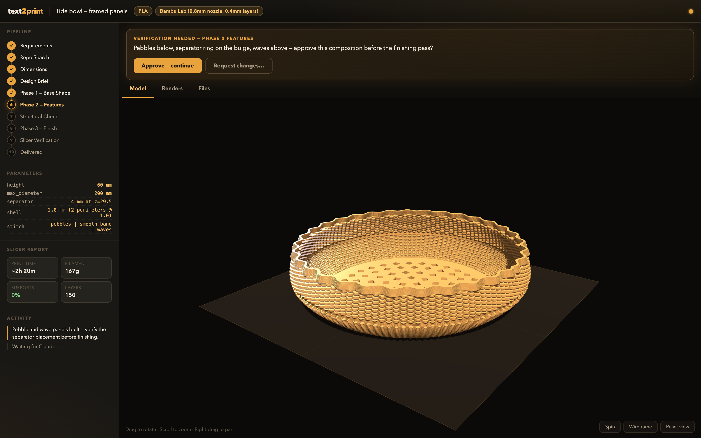
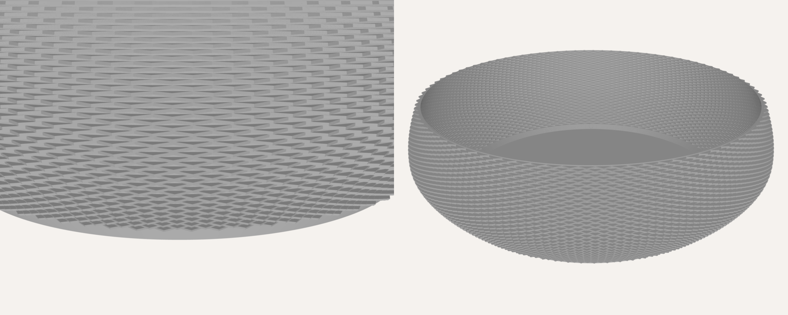
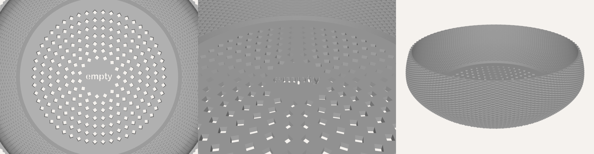

# Parametric 3D Printing Skill for Claude Code

A [Claude Code](https://docs.anthropic.com/en/docs/claude-code) skill that designs production-ready 3D-printable models. Describe a part; Claude researches real-world dimensions, builds it parametrically in [CadQuery](https://cadquery.readthedocs.io/) (or procedural mesh code when the geometry demands it), verifies it structurally, slices it headlessly, and delivers a print-ready STL with settings — while you watch it take shape live in your browser.

<p align="center">
  
</p>

---

## The pipeline

The skill picks one of four modes from what you ask:

| Mode | Trigger | What happens |
|------|---------|--------------|
| **New Design** | "Design me a…" | Requirements → repo search → design brief → phased build → structural check → slicer verification → delivery |
| **STL Reference** | Provide an existing STL | Analyzes the mesh, recovers dimensions, then modifies it or uses it as inspiration |
| **Overhang Fix** | "This keeps failing at the overhang" | Ray-cast ceiling map + manifold3d boolean fill — overhangs removed without slicer supports |
| **Printability Audit** | "Will this print?" | Watertight check, overhang detection, wall analysis, auto-repair, orientation recommendation |

Nothing is guessed along the way:

- **Reference tables built in** — material profiles (PLA/PETG/ABS/ASA/TPU/PA-CF), clearance and press fits, snap-fit arm geometry, living hinges, heat-insert and screw dimensions, SBC mounting patterns, magnet pockets
- **Repo search first** — checks MakerWorld, Printables, Thingiverse, Cults3D, and MyMiniFactory before designing from scratch
- **Structural pass before delivery** — fill ratio, steep overhangs, wall thickness, and cantilever rules per material
- **Slicer verification** — slices with PrusaSlicer CLI and reports time, filament, and support volume; more than 25% support means redesign, not delivery

Every delivery ends with print settings, orientation and reasoning, a slicer report, and a parameter table with an offer to tweak:

```
Print settings: PETG, 0.2mm layer, 3 walls, 20% gyroid infill, no supports.
Orientation: flat base on bed (open top faces up).
Slicer report: ~3h 40m · 31g · no supports · 184 layers.
```

---

## Quick start

```bash
mkdir -p ~/.claude/skills
git clone https://github.com/stilwellc/parametric-3d-printing ~/.claude/skills/parametric-3d-printing

# Python 3.10–3.12 (CadQuery's OCC kernel has no 3.13+ wheels)
cd ~/.claude/skills/parametric-3d-printing
python3.12 -m venv .venv && source .venv/bin/activate
pip install -r requirements.txt
```

Optional, for slicer verification: install [PrusaSlicer](https://www.prusa3d.com/page/prusaslicer_424/) (on macOS the CLI lives at `/Applications/PrusaSlicer.app/Contents/MacOS/prusa-slicer`). Without it the skill skips verification and says so in the delivery.

Then just ask, in Claude Code:

```
"Design a parametric enclosure for an Arduino Uno with a snap-fit lid, PETG, Bambu X1C"
"Here's my STL — make the top 10mm taller and add a cable slot on the left side"
"This overhang keeps failing at 15mm height even with supports"
"Will this print? [attaches STL]"
```

The skill auto-triggers on requests like these, or invoke it directly with `/parametric-3d-printing`.

---

## Live design UI

Watch the build happen instead of waiting for the final STL:

```bash
source .venv/bin/activate
python3 tools/ui_server.py     # http://localhost:7384
```

A single-file Flask app that watches the skill directory and streams updates to the browser as Claude works: the latest STL in an orbitable Three.js viewer, multi-view preview renders, a phase tracker for the pipeline, the current parameter values, and the slicer report. Older exports stay listed so you can flip back to earlier iterations.

---

## Reusable textures

**Printed fabric (zigzag textile) walls — `textures/zigzag_fabric.py`**

<p align="center">
  
</p>

Walls that are light, airy, and see-through: a thin shell whose contour alternates per print layer — zigzag layers swinging outward, straight layers between, alternate bands phase-shifted so they crisscross into open diamonds. The zigzag layers bridge in mid-air; the result behaves like printed textile, not a solid wall with surface relief.

```python
from textures.zigzag_fabric import fabric_solid
tm = fabric_solid(profile_fn, height=60.0, layer_h=0.2,
                  zigzags_around=90, zigzag_depth=2.0,
                  zigzag_layers=3, straight_layers=2)
```

The geometry is staircase-quantized to print layers, so the slicer layer height must exactly match `layer_h`. Print with 2 perimeters, 0% infill, no top layers, vase mode off, full cooling. Full rules live in the "Printed Fabric Walls" section of `SKILL.md`. Pair it with the `textures/floor_cuts.py` helpers — crisscross diamond cutout rings and stencil-bridged through-cut text, with a hard guard against loose islands that would detach on the print bed — to perforate the solid floor to match:

<p align="center">
  
</p>

---

## Gallery

<p align="center">
  
  
</p>
<p align="center">
  
  
</p>

More on [MakerWorld](https://makerworld.com/en/@sercanto).

---

## Repository layout

| File | Purpose |
|------|---------|
| `SKILL.md` | The skill itself: 4-mode workflow, design constants, all reference tables |
| `tools/ui_server.py` | Live design UI (Flask + Three.js) at `localhost:7384` |
| `tools/run_cadquery_model.py` | Runs a CadQuery script, renders preview, emits JSON for Claude's self-correct loop |
| `tools/preview.py` | Headless STL → multi-view PNG renderer; `--strict` fails on non-watertight meshes |
| `textures/zigzag_fabric.py` | Reusable printed-fabric wall generator |
| `textures/floor_cuts.py` | Floor through-cut helpers: diamond rings + stencil-bridged text, loose-island guard |
| `tools/mesh_io.py` | STL loading with validation (no pyrender dependency) |
| `tools/stl_to_3mf.py` | STL → 3MF converter for Bambu Studio / PrusaSlicer |
| `docs/design-review.md` | Visual inspection checklist and printability analysis helpers |
| `tests/` | Pytest suite for the mesh tooling and fabric generator |

---

## License

[PolyForm Noncommercial 1.0.0](LICENSE) — free to use, modify, and distribute for noncommercial purposes.

Built on [cad-skill](https://github.com/flowful-ai/cad-skill) by [Nicolas Chourrout](https://github.com/nchourrout).
